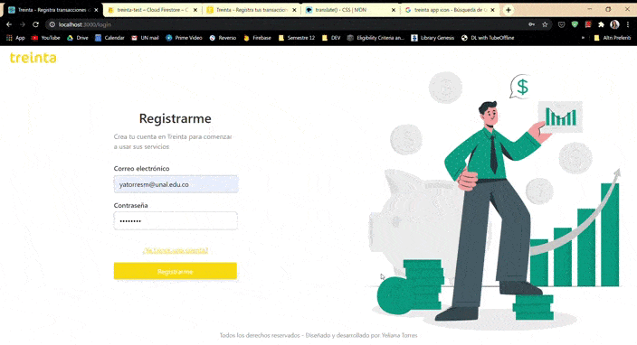

# Treinta-test

Treinta-test is a web app designed and developed by Yeliana Torres as a development test for the company Treinta. All the code and designs that you can see here, have all the rights reserved for Yeliana Torres.

## The company

[Treinta](https://www.treinta.co/) company is a mobile app startup for Colombian and Mexican small buissinesses who want to record their transactions easy and using the smartphone.

## Development

This platform is developed with:
- Firebase services for the back-end
- [React.js](https://github.com/facebook/react) for the front-end using mainly the libraries:
  - [Google-maps-react](https://www.npmjs.com/package/google-maps-react) to create and manage the map.
  - [Styled-components](https://github.com/styled-components/styled-components) to create the design system.
  - [React-router](https://github.com/styled-components/styled-components) to handle all the routes.

Note: This app follows the [Atomic Design](https://codeburst.io/atomic-design-with-react-e7aea8152957) principles to create all the presentational and non-presentational components and doesn't use any css library.

## Installation

In the project directory, you can run:

`npm install`

Runs the app in the development mode. 
Open [http://localhost:3000](http://localhost:3000) to view it in the browser.

`npm start`

Runs the app in the development mode. 
Open [http://localhost:3000](http://localhost:3000) to view it in the browser.

`npm build`

Builds the app in the folder `/build`. 
Open [http://localhost:3000](http://localhost:3000) to view it in the browser.

`npm deploy`

Builds and deploy the app to the firebase hosting. 
Open [https://treinta-test.web.app/login](https://treinta-test.web.app/login) to view it in the browser.
